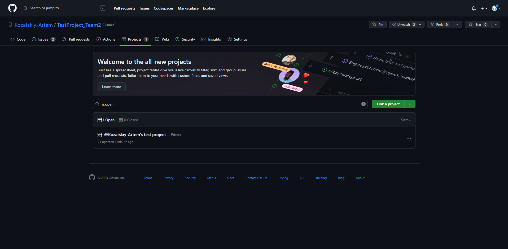

# How to work with repository
First, you need to clone the repository to your local machine by running the following command:
`git clone git@github.com:Kozatskiy-Artem/TestProject_Team2.git`

While working on the project, we will distribute tasks to each participant, the board in the repository will help us with this.
It is located in the projects tab on the repository page.

We will create a task (card) on the board, describe it and assign it to the participant. 
During the execution of the task, the card can be moved depending on the state.

It is desirable to create a new branch under each task, the name of which would make it clear what is happening there.
But you don't need to come up with too long titles, task cards and commit messages are for that
Examples:
`git checkout -b dev-user-api` or `git checkout -b dev-login-page`

After you pushed new branch to repository, you need to create pull request. 
To do it, you need to click on 'Pull requests' -> 'New pull request'.

You can review the changes made in the 'Files changed' tab to ensure everything looks good. 
After that you need to click on "Create pull request" as highlighted by the arrow. 
'Compare' should be your newly-created branch and 'base' should be 'dev'. 
The only branch from which we will be creating pull requests to 'main' will be the 'dev' branch.

Once you have reviewed and filled in the necessary information such as the name of pull request and description,
click on the 'Create pull request' button again to submit your pull request.
It will also be a good practice to assign another participant to do a code review when creating a pull request.

